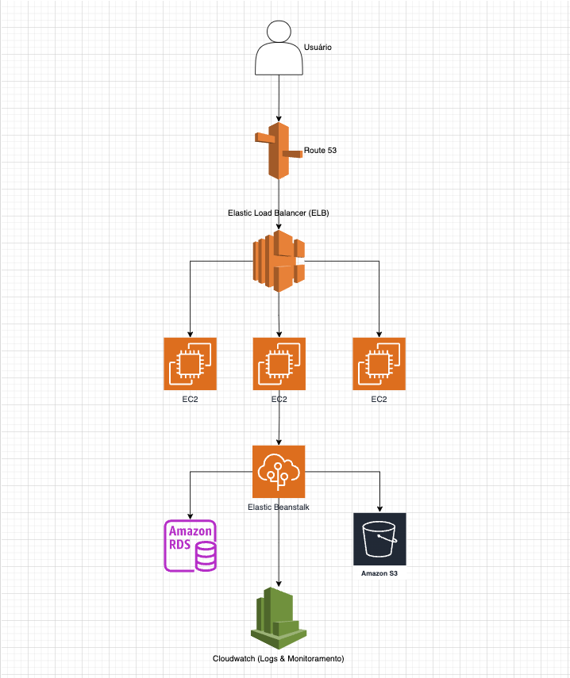

# Documentação da Aplicação Vitivinicultura

## Introdução

Esta é uma API desenvolvida em FastAPI para obter e exibir dados de vitivinicultura, como produção, processamento, comercialização, importação e exportação de uvas e vinhos. Os dados são extraídos do site da Embrapa Uva e Vinho e podem ser acessados por meio de uma interface web ou pelo postman.

## Autor

- Kirk Patrick (MLET1 - Grupo 66)
- Você pode entrar em contato com o autor pelo LinkedIn: [https://www.linkedin.com/in/kirkgo/](https://www.linkedin.com/in/kirkgo/)

## Requisitos

 - Docker 
 - Python 3.10.9

## Estrutura do Projeto

    .
    ├── app.py                                  # Código da API
    ├── data                                    # Diretório onde os arquivos CSVs serão salvos
    │   └── arquivo.csv             
    ├── postman                                 # Diretório onde está a collection e o env do postman
    │   └── dev_environment.json
    │   └── vitivinicultura_collection.json
    ├── templates
    │   └── index.html                          # Template HTML da interface web
    ├── requirements.txt                        # Arquivo de dependências do Python
    ├── Dockerfile                              # Dockerfile para construção da imagem Docker
    └── docker-compose.yml                      # Docker Compose para configuração dos serviços
    
### Dependências

A API utiliza as seguintes bibliotecas Python, especificadas no arquivo `requirements.txt`:

    fastapi
    uvicorn
    jinja2
    beautifulsoup4
    requests
    pandas

### Postman Collection

Dentro da pasta `postman` você vai encontrar a collection e o environment para utilizar a API através do postman. 

## Arquitetura

### Descrição dos Componentes

1. **Usuário:** Interage com a API via navegador ou cliente HTTP (como Postman).
2. **Amazon Route 53 (Opcional):** Serviço de DNS para roteamento de tráfego.
3. **Elastic Load Balancer (ELB):** Distribui o tráfego de entrada entre as instâncias EC2.
5. **Amazon EC2 Instances:** Executa os contêineres Docker com a API FastAPI.
6. **Amazon Elastic Container Registry (ECR) (Opcional):** Armazena imagens Docker (se você estiver usando ECR para armazenar suas imagens Docker).
7. **AWS Elastic Beanstalk:** Gerencia o ambiente de aplicação, incluindo balanceamento de carga, escalabilidade, monitoramento e manutenção.
8. **Amazon RDS (Opcional):** Banco de dados relacional para persistência de dados.
9. **Amazon S3 (Opcional):** Armazenamento de objetos, por exemplo, para armazenar arquivos estáticos ou backups de banco de dados.
10. **CloudWatch:** Monitoramento e logging da aplicação e infraestrutura.

### Explicação dos Componentes

1. **Usuário:** O ponto inicial onde os usuários interagem com a API através de HTTP/HTTPS.
2. **Amazon Route 53:** Serviço de DNS para rotear as solicitações para o ELB.
3. **Elastic Load Balancer (ELB):** Gerencia a distribuição de tráfego de entrada entre as instâncias EC2.
4. **Amazon EC2 Instances:** Hospedam os contêineres Docker que executam a aplicação FastAPI.
5. **AWS Elastic Beanstalk:** Facilita o deploy, escalabilidade e gerenciamento da aplicação. Automatiza a criação do ELB, EC2, etc.
6. **Amazon RDS:** Banco de dados relacional opcional para persistência de dados, como PostgreSQL, MySQL, etc.
7. **Amazon S3:** Armazenamento de objetos para arquivos estáticos ou backups.
8. **CloudWatch:** Serviço de monitoramento e logs para acompanhar a performance da aplicação e infraestrutura.

## Como Rodar a Aplicação no Ambiente de Dev

### Passo 1: Clonar o Repositório

Clone o repositório da API na sua máquina local.

    https://github.com/kirkgo/vinicultura-embrapa.git
    cd vinicultura-embrapa.git

### Passo 2: Construir e Iniciar os Contêineres

Utilize o Docker Compose para construir e iniciar os contêineres da aplicação.

    docker-compose up --build

Este comando irá:

1.  Construir a imagem Docker com base no `Dockerfile`.
2.  Iniciar o serviço definido no `docker-compose.yml`, que por padrão estará disponível na porta `8000`.

### Passo 3: Acessar a Aplicação

Depois que os contêineres estiverem em execução, você pode acessar a API via postman ou usar interface web através do navegador em:

    http://localhost:8000

#### Credenciais de Acesso

Abaixo estão as credenciais para acessar a aplicação: 

- Usuário: admin
- Password: mlet1

## Como fazer Deploy da Aplicação na AWS

Para preparar a API para deployment na AWS, é necessário seguir os passos abaixo. Vamos fazer o deploy na AWS Elastic Beanstalk. A AWS EB é uma plataforma que facilita o gerenciamento e o deployment de aplicações web. É possível também utilizar outras soluções como: AWS ECS, EC2 ou Lambda.

### Passos para Deploy usando AWS Elastic Beanstalk

1. Instalar a AWS CLI e o EB CLI
2. Configurar a AWS CLI
3. Preparar a aplicação
4. Criar arquivos de configuração para Elastic Beanstalk
5. Deploy usando o EB CLI

#### 1. Instalar a AWS CLI e o EB CLI

**Instalar o AWS CLI**

Se você ainda não tem a AWS CLI instalado, siga as instruções da documentação oficial: [AWS CLI Installation](https://docs.aws.amazon.com/cli/latest/userguide/getting-started-install.html)

**Instalar o EB CLI**

Instale o EB CLI, que é a ferramenta de linha de comando do Elastic Beanstalk.

    pip install awsebcli --upgrade

#### 2. Configurar a AWS CLI

Configure suas credenciais da AWS para permitir que o EB CLI interaja com sua conta AWS.

    aws configure

Forneça suas chaves de acesso, região e formato de saída preferido.

#### 3. Preparar sua aplicação

Certifique-se de que o `Dockerfile` esteja na raiz do projeto.

#### 4. Criar arquivos de configuração para Elastic Beanstalk

**Arquivo Dockerrun.aws.json**

Crie um arquivo `Dockerrun.aws.json` na raiz do projeto. Este arquivo informa ao Elastic Beanstalk como executar a aplicação Docker.

    {
      "AWSEBDockerrunVersion": 2,
      "containerDefinitions": [
        {
          "name": "fastapi-app",
          "image": "public.ecr.aws/lambda/python:3.9-slim",
          "essential": true,
          "memory": 512,
          "portMappings": [
            {
              "containerPort": 8000
            }
          ]
        }
      ]
    }

**Arquivo `.ebextensions` (opcional)**

Você pode criar um diretório `.ebextensions` e adicionar arquivos de configuração adicionais, como variáveis de ambiente, configuração do banco de dados, etc.

#### 5. Deploy usando o EB CLI

**Inicializar o Elastic Beanstalk**

No diretório raiz do projeto, inicialize o Elastic Beanstalk.

    eb init

Siga as instruções para configurar o aplicativo e ambiente.

**Criar um Ambiente**

Crie um ambiente para a aplicação.

    eb create vitivinicultura-env

**Fazer o Deploy da Aplicação**

Faça o deploy da aplicação para o ambiente criado.

    eb deploy

**Verificar o Deployment**

Após o deploy, você pode verificar o status da aplicação no console do Elastic Beanstalk:

    eb status

E abrir a aplicação no navegador:

    eb open

#### 6. Configurar Variáveis de Ambiente (opcional)

Se você precisar configurar variáveis de ambiente, pode fazer isso pelo console do Elastic Beanstalk ou usando o comando EB CLI:

    eb setenv KEY1=value1 KEY2=value2

#### Estrutura Final do Projeto

O projeto de deployment deve ter a seguinte estrutura agora:

    /app
    │   Dockerfile
    │   Dockerrun.aws.json
    │   requirements.txt
    │   app.py
    │   ...
    └───.ebextensions
            someconfig.config
    └───templates
            index.html
            ...
 
### Notas Finais

-   **Segurança**: Certifique-se de que suas chaves de acesso AWS não estão no código fonte.
-   **Escalabilidade**: Elastic Beanstalk facilita a escalabilidade da aplicação. Você pode configurar o escalonamento automático no console do Elastic Beanstalk.
-   **Logs e Monitoramento**: Use as ferramentas de logs e monitoramento fornecidas pelo Elastic Beanstalk para acompanhar o desempenho e resolver problemas da aplicação.

Seguindo esses passos, o deploy da aplicação na AWS usando Elastic Beanstalk estará concluído.

## Uso da Aplicação

### Login

1.  Acesse a página inicial da aplicação.
2.  Preencha o formulário de login com as seguintes credenciais:
    -   **Username**: `admin`
    -   **Password**: `mlet1`
3.  Clique no botão **Login**.

### Navegação e Consulta de Dados

1.  Após o login, você verá os botões de dados disponíveis. Selecione a opção de dados desejada no menu suspenso.
2.  Se a opção selecionada requerer um ano específico, escolha o ano desejado no menu de seleção de anos.
3.  Clique no botão **Buscar Dados** para obter os dados.
4.  Os dados serão exibidos na seção **Resultado** e um link para download do arquivo CSV será mostrado na seção **Arquivo Gerado**.

### Logout

1.  Para sair da aplicação, clique no botão **Logout** no canto superior direito.

## Endpoints da API

### Autenticação

-   **Endpoint**: `/token`
-   **Método**: `POST`
-   **Descrição**: Gera um token de acesso para o usuário autenticado.
-   **Parâmetros**:
    -   `username`: Nome de usuário
    -   `password`: Senha do usuário

### Dados de Produção

-   **Endpoint**: `/producao`
-   **Método**: `GET`
-   **Descrição**: Obtém os dados de produção para o ano especificado.
-   **Parâmetros**:
    -   `ano`: Ano (padrão é o ano atual)

### Dados de Processamento

-   **Endpoint**: `/processamento`
-   **Método**: `GET`
-   **Descrição**: Obtém os dados de processamento para o ano especificado de acordo com a opção selecionada.
-   **Parâmetros**:
    -   `subopcao`: Subopção (ex: `viniferas`, `americanas-e-hibridas`, `uvas-de-mesa`, `sem-classificacao`)
    -   `ano`: Ano (padrão é o ano atual)

### Dados de Comercialização

-   **Endpoint**: `/comercializacao`
-   **Método**: `GET`
-   **Descrição**: Obtém os dados de comercialização para o ano especificado.
-   **Parâmetros**:
    -   `ano`: Ano (padrão é o ano atual)

### Dados de Importação

-   **Endpoint**: `/importacao`
-   **Método**: `GET`
-   **Descrição**: Obtém os dados de importação para o ano especificado de acordo com a opção selecionada.
-   **Parâmetros**:
    -   `subopcao`: Subopção (ex: `vinhos-de-mesa`, `espumantes`, `uvas-frescas`, `uvas-passas`, `suco-de-uva`)
    -   `ano`: Ano (padrão é o ano atual)

### Dados de Exportação

-   **Endpoint**: `/exportacao`
-   **Método**: `GET`
-   **Descrição**: Obtém os dados de exportação para o ano especificado de acordo com a opção selecionada.
-   **Parâmetros**:
    -   `subopcao`: Subopção (ex: `vinhos-de-mesa`, `espumantes`, `uvas-frescas`, `suco-de-uva`)
    -   `ano`: Ano (padrão é o ano atual)

### Download de Arquivos

-   **Endpoint**: `/download/{filename}`
-   **Método**: `GET`
-   **Descrição**: Faz o download do arquivo especificado.
-   **Parâmetros**:
    -   `filename`: Nome do arquivo a ser baixado

## Considerações Finais

Este guia fornece as instruções básicas para configurar, rodar e utilizar a aplicação de vitivinicultura. Para qualquer dúvida ou problema, consulte a documentação oficial do FastAPI ou entre em contato com o desenvolvedor responsável.
